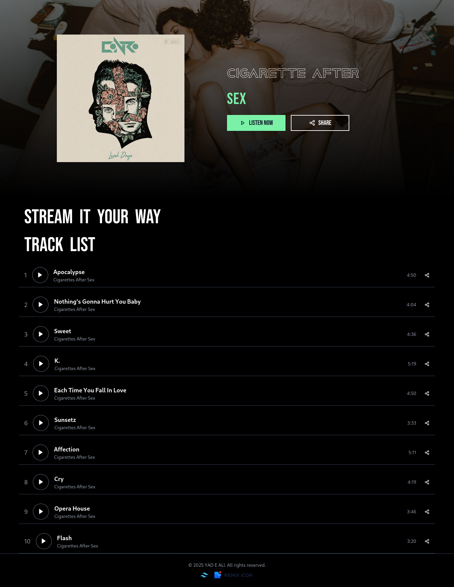
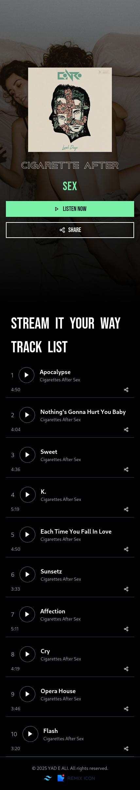

# Cigarette After Sex | Library

## Overview
This is a web-based music library dedicated to the band **Cigarette After Sex**. The site features an interactive track list and a stylish UI using Tailwind CSS.

## Features
- Interactive music player with play/pause functionality.
- Responsive design for both desktop and mobile.
- Social media links and share functionality.
- Beautiful background and typography for an immersive experience.

## Technologies Used
- **HTML5**
- **CSS3 (Tailwind CSS)**
- **JavaScript**
- **Remix Icons**

## Screenshots
### Web Version


### Mobile Version


## Installation & Usage
1. Clone the repository:
   ```sh
   git clone https://github.com/your-repo-link.git
   ```
2. Navigate to the project directory:
   ```sh
   cd project-folder
   ```
3. Open the `index.html` file in your browser.

## License
This project is for educational purposes only.
